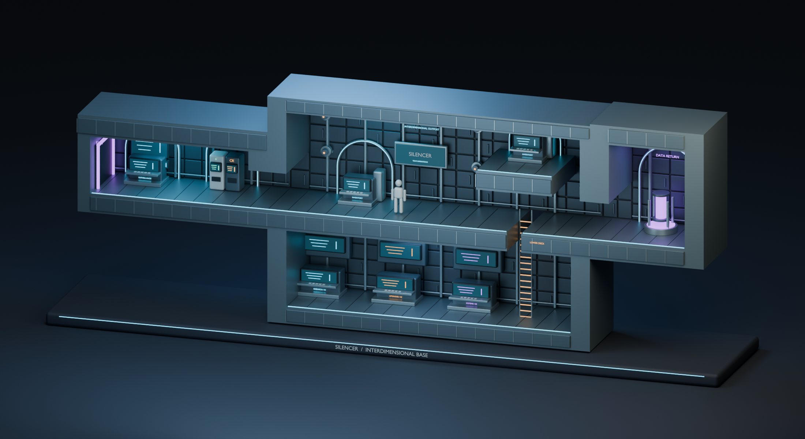

# Interdimensional base - artist mockup

**Start with [START-HERE.png](START-HERE.png).** This is a 3D cutaway study of
[`XBASE15A.SIL`](../../shared/assets/XBASE15A.SIL), not a redesigned level
or production-ready environment. Only this base is included.



## Files

| File | Purpose |
| --- | --- |
| `START-HERE.png` | Artist sheet: 3D overview, original tiles and design boundaries |
| `interdimensional-base.blend` | Editable scene, named collections, materials, three cameras and packed source reference |
| `interdimensional-base.glb` | Portable mesh/material handoff; import into Blender or another glTF-capable DCC |
| `01-cutaway.png` | Full-base three-quarter view |
| `02-front-elevation.png` | Orthographic side-on layout view |
| `03-operations-detail.png` | Closer view of operations and the lower tech room |
| `source-reference.png` | Original unlit tile composite with numbered source actor anchors |
| `source-tiles.png` | Full-size unlit tile composite, also packed into the Blender scene |
| `source-map.json` | Source checksum, all platform coordinates and all actor records |
| `scene-manifest.json` | Generated scene inventory |

The native file was created with Blender 5.2.1. Use the GLB for applications
that cannot open that Blender version. The GLB includes architecture and
equipment, but excludes the display plinth, scale figure, lights, cameras,
reference plane and hidden collision guides. It has no external texture
dependencies. Lighting and glow presentation depend on the importing app.

## Source fidelity

The original map is **47 x 26 tiles**, each **64 x 64 pixels**. There are
**17 collision records** (16 rectangles, one ladder) and **20 actor anchors**.
The rectangles' side-on coordinates are preserved exactly in collection
`01 SOURCE`; the ladder and zero-height rectangle P08 are hidden guides.
Their visible ladder/hatch interpretation lives separately in `04 CONCEPT`.
Actor anchors retain their original fields as custom properties, and each
equipment assembly is parented to its anchor.

The source has a low left support room, tall central operations hall, raised
inventory platform, lower room with three tech stations, and a right-hand
secret-return chamber. Wall-defense mounts occupy the nine encoded positions.
The base exit remains against the left wall; it has not been replaced with
an invented central portal.

The tile reference follows the engine's tile decoding and palette 0. It
omits actor sprites, parallax and runtime luminosity, so it is **not a game
screenshot**. The file contains 958 uses of tile `0x0701`, whose bank 7 is
empty in `BIN_TIL.DAT`; these are not drawn, as in the engine.

## Intentional interpretation

The `.SIL` file supplies a 2D layout, not a depth or physical scale.
This study chooses **one tile = one design metre** and a **4m corridor depth**.
Blender uses X across the level, Z up, and Y into the room:

```text
X = (source_x - 448) / 64
Z = (1094 - source_y) / 64
Y = -2 at the open front, +2 at the rear wall
```

The displayed person is a **1.8m presentation scale cue**, not a source actor.
glTF export uses its standard Y-up coordinates, converting the Blender axes.

All equipment shapes, rear walls, alcoves, paneling, signage, metal finishes,
light colors and the data-core effect are concept placeholders. The original
rounded industrial recesses inform the alcoves; the exact collision shell
remains visibly square so artists can distinguish layout from dressing.

The healing and credit machines share `(895, 717)` in the source. Their two
anchors remain coincident; their visible dispensers are offset left/right
by 0.42m to read as one support bay. The secret-return anchor is 30px above
the floor; its pedestal rests on the floor without moving that anchor.

Refine the industrial/interdimensional architecture while preserving room
connections, equipment locations and the side-on gameplay silhouette.
This is not a finished UV/texture set, optimized game mesh, collision import,
animation rig or playable level.

## Working in Blender

The saved scene opens at `CAM 01 / cutaway overview`. The other two cameras
are in `06 PRESENTATION`. Collections `01` and `02` contain source-derived
data; `03` through `05` contain the concept.

To compare against the original tiles, enable collection `07 REFERENCE`,
hide the concept collections, and select the source-aligned front camera.
The packed reference is positioned behind the model on the same X/Z grid.
Use material preview to see it. Use Blender's Outliner to unhide the P08
and P09 guides when inspecting the exact hatch/ladder records.

## Regeneration

Run from the repository root. `source_map.py` and `make_handout.py` need
Python with Pillow; `build_scene.py` runs in Blender's bundled Python.
No game build or third-party Blender add-ons are required.

```bash
python3 mockups/interdimensional-base/source_map.py
/Applications/Blender.app/Contents/MacOS/Blender \
  --background --factory-startup --python-exit-code 1 \
  --python mockups/interdimensional-base/build_scene.py
python3 mockups/interdimensional-base/make_handout.py
```

On other platforms, replace the macOS executable path with `blender`.
Appending `-- --no-render` to the Blender command regenerates only the scene,
GLB and manifest. The full command regenerates all three render images too.
Regeneration **overwrites the generated files**; save hand-edited scenes
under another filename before running it.

The scripts read the original `.SIL` and tile assets without modifying them.
The shared decoder (`../sil_reference.py`) covers this base and the original
top-level maps in `shared/assets/level/`; it is not a general `.SIL` importer
and rejects unsupported trailing sections. The base's scene builder remains
specific to `XBASE15A.SIL`.
Source format references:
`clients/silencer/src/world/map/map.cpp`,
`clients/silencer/src/resources/resources.cpp`,
`web/admin/app/designer/useSilMap.ts` and `useGameData.ts`.
